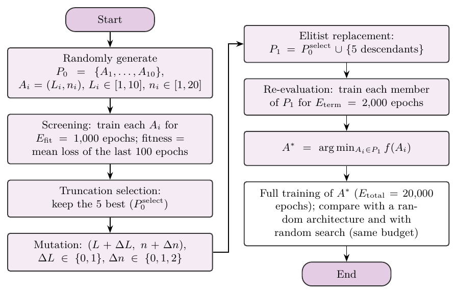
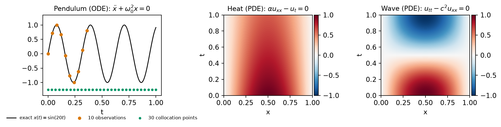
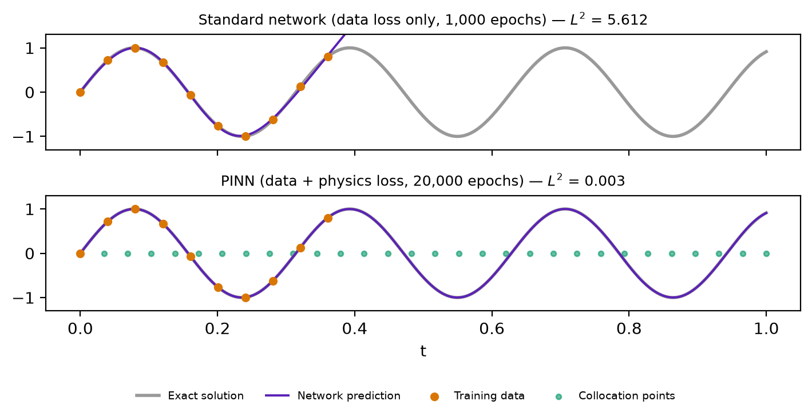
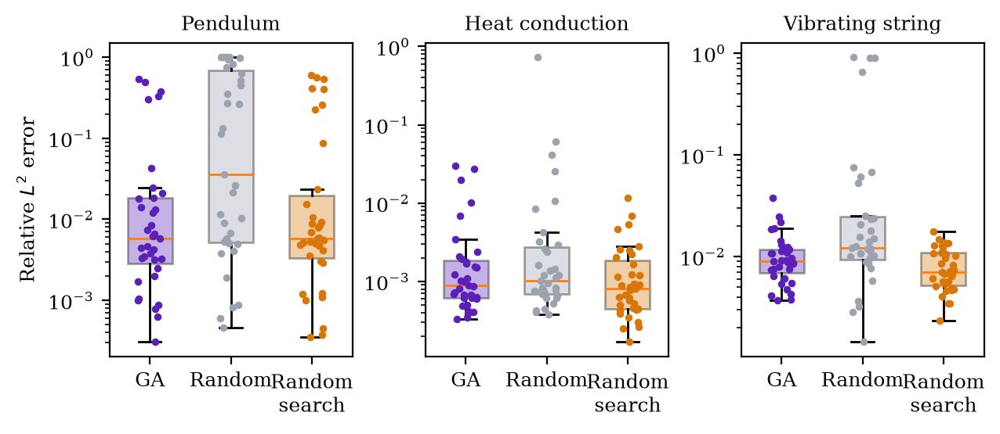
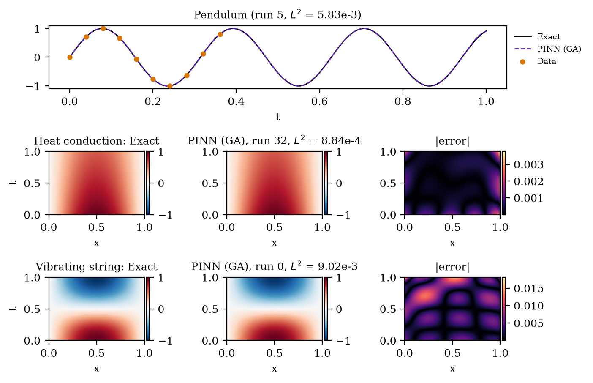
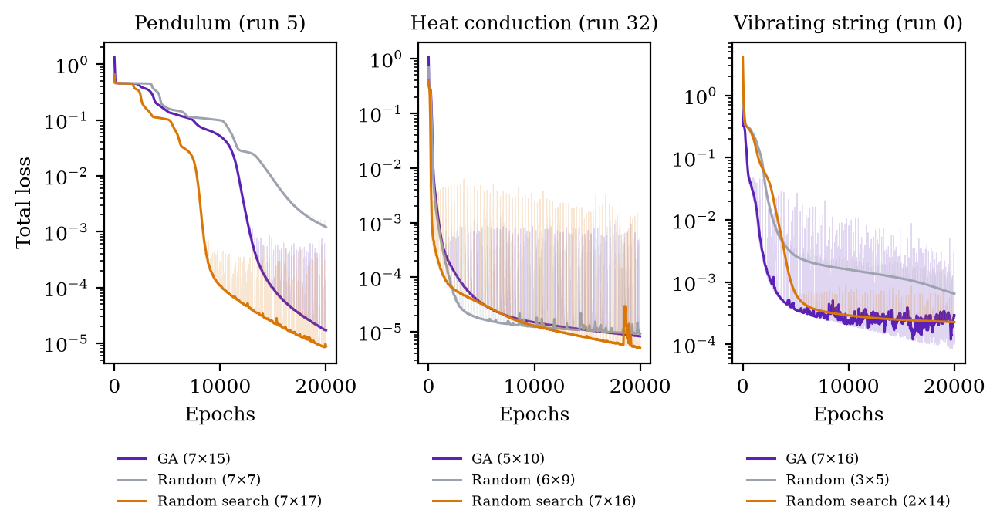

# Neuroevolution for the Architecture Search of Physics-Informed Neural Networks


Code for the MBA in Artificial Intelligence and Big Data monograph (ICMC, University of São Paulo) and for the
derived article *Applying Neuroevolution to the Architecture Search of Physics-Informed Neural Networks*
(Gabriel Milanez Cavalheri and Rodrigo Colnago Contreras).

**Question.** The accuracy of a Physics-Informed Neural Network (PINN) depends on its architecture, and choosing
it by trial and error is expensive, because every candidate requires solving the differential equation. Can a
*cheap* Genetic Algorithm, guided only by short partial trainings, choose better PINN architectures than a random
choice, and does it beat random search with the same budget?

**What this repository does.** A single-generation, mutation-only Genetic Algorithm searches the number of hidden
layers and neurons per layer of a PINN, while the weights are trained by gradient descent (Adam). The search costs
about 1.5 full trainings. It is evaluated on three classical problems with exact solutions (a pendulum ODE, the
heat equation, and the wave equation), in 35 seeded runs per problem, against a random architecture and against
random search with the same epoch budget, using the relative L2 error against the exact solution.

---

## Method



An individual is an architecture `A = (L, n)`: `L` hidden layers with `n` neurons each (the same width in every
hidden layer; input and output sizes come from the problem). The fitness is the total PINN loss averaged over the
last 100 epochs of a partial training, so the search never uses the exact solution.

Each run compares three arms, all ending with a full training (20,000 epochs) of the chosen architecture:

| Arm | How the architecture is chosen | Search budget |
|---|---|---|
| `ga` | 10 random architectures × 1,000 epochs → truncation selection of the 5 best → mutation (ΔL ∈ {0,1}, Δn ∈ {0,1,2}) → 10 × 2,000 epochs → best | 30,000 epochs |
| `random` | one architecture drawn at random | none |
| `random_search` | best of 10 random architectures trained for 3,000 epochs | 30,000 epochs |

The `random` arm measures the gain of any search over no search; `random_search` isolates the contribution of the
evolutionary operators from the effect of simply evaluating more candidates.

## Benchmark problems



| Problem | Equation | Exact solution | Loss terms | Learning rate |
|---|---|---|---|---|
| `pendulum` | x'' + ω₀²x = 0, ω₀ = 20, t ∈ [0, 1] | sin(20t) | MSE of 10 observations (t < 0.4) + 10⁻⁴ · residual at 30 collocation points | 10⁻⁴ |
| `heat` | α u_xx − u_t = 0, α = 0.05 | sin(πx) e^(−απ²t) | residual (100 × 250 grid) + initial condition + boundaries | 10⁻³ |
| `wave` | u_tt − c² u_xx = 0, c = 1 | sin(πx) cos(πt) | residual + initial condition + initial velocity + boundaries | 10⁻³ |

All networks use **tanh** activations and Xavier initialization. PDE problems are dimensionless on x, t ∈ [0, 1].

## Why physics in the loss matters

With the same architecture and the same 10 observations, a standard network fits the data but cannot extrapolate,
while the PINN recovers the whole oscillation (`scripts/fig_nn_vs_pinn.py`, seed 2026):



## Results

All 105 runs (35 per problem, seeds 1000–1034) finished without divergence; they took about 23 hours with three
runs in parallel on an RTX 2060 Mobile. Primary metric: relative L2 error of the final network against the exact
solution.



| Problem | Median error: GA | Random | Random search | GA vs random: wins, p<sub>W</sub> (Holm), median ratio | GA vs random search: wins, p<sub>W</sub> (Holm), median ratio |
|---|---|---|---|---|---|
| Pendulum | 5.8 × 10⁻³ | 3.6 × 10⁻² | 5.8 × 10⁻³ | **23/35**, **0.027**, 4.62 | 20/35, 0.88, 1.58 |
| Heat | 8.8 × 10⁻⁴ | 1.0 × 10⁻³ | 8.1 × 10⁻⁴ | 21/35, 0.74, 1.49 | 16/35, 1.00, 0.93 |
| Wave | 9.0 × 10⁻³ | 1.2 × 10⁻² | 7.0 × 10⁻³ | **26/35**, **0.003**, 1.78 | 12/35, 1.00, 0.76 |

p<sub>W</sub>: one-sided Wilcoxon signed-rank test on the paired log-ratios, Holm-adjusted over the six comparisons.
Median ratio: reference error ÷ GA error (above 1 favors the GA). Binomial tests, Wilson intervals, bootstrap
intervals and the secondary metric (final loss) are in [`results/summary.json`](results/summary.json) and
[`results/tables/`](results/tables).

**Findings**

- **Searching pays off over a random choice.** In a typical run, the random architecture erred 1.5× to 4.6× more than
  the GA (median of the paired error ratios), and the GA avoided almost all failures of the random arm (relative error above 0.5 in 11 pendulum, 1 heat and 4 wave runs, against 1, 0 and 0 for
  the GA). The improvement is significant for the pendulum and the wave equation; in the heat equation almost any
  tanh network reaches an error of about 10⁻³.
- **The evolutionary operators do not beat random search with the same budget.** Random search (10 candidates ×
  3,000 epochs) tied with the GA in all problems and was slightly ahead in the wave equation (23/35 wins; exploratory
  test, p = 0.066 after Holm). Evaluating diverse candidates for longer seems worth more than small mutations of the
  best ones.
- **The partial-training loss is a reliable proxy.** Spearman correlation between the fitness after 1,000 epochs and
  the error of the 350 screened candidates per problem: 0.79 (pendulum), 0.93 (heat), 0.99 (wave).
- The GA selects the largest networks (mutation only grows them), so its search took 25–35% more time than random
  search with the same number of epochs.

PINN of the median GA run of each problem:



Total loss along the full training in the same runs (thin: every epoch; thick: 200-epoch rolling median):



## Installation

```bash
git clone https://github.com/GMCavalheri/MBA-PINN-Neuroevolution.git
cd MBA-PINN-Neuroevolution
python3 -m venv .venv
.venv/bin/pip install torch==2.11.0 --index-url https://download.pytorch.org/whl/cu128
.venv/bin/pip install -r requirements.txt
.venv/bin/python -m pytest -q          # 26 tests (GPU tests are skipped without CUDA)
```

## Usage

```bash
.venv/bin/python scripts/benchmark_amp.py                           # fp32 vs AMP, CPU vs GPU, workers
.venv/bin/python scripts/run_experiment.py --problem heat --workers 3
.venv/bin/python scripts/run_experiment.py --problem wave --runs 0-4 # a subset of runs
.venv/bin/python scripts/make_tables_figs.py                        # statistics, LaTeX tables, figures
scripts/run_all.sh                                                  # everything, in sequence
```

Runs are resumable: a run whose `results/<problem>/run_XX.json` exists is skipped. A thermal guard pauses the
workers while the GPU is at or above 80 °C and resumes them at 72 °C (`--pause-at`, `--resume-at`).

## Reproducibility

- Every random decision of run `r` (initial population, mutations, reference architectures, weight
  initializations) is derived from the master seed `1000 + r` through `numpy.random.SeedSequence`; the derived seeds
  are stored in each `run_XX.json`.
- CPU runs are bit-exact. GPU runs use deterministic algorithms (`torch.use_deterministic_algorithms(True)`,
  `CUBLAS_WORKSPACE_CONFIG=:4096:8`) and are identical on the same hardware, software versions and execution mode,
  which are also recorded in the JSON.
- Configuration lives in `configs/*.yaml`; each run stores the full configuration and its hash.

## GPU performance

These networks are tiny, so training time is dominated by launching many small GPU kernels. On CUDA, the whole
training step (loss, second derivatives through `torch.autograd.grad`, backpropagation and Adam) is captured once in a
**CUDA graph** and replayed, which is 3 to 13 times faster than eager execution on an RTX 2060 Mobile. Automatic mixed
precision (fp16) was benchmarked and rejected: it was slower and increased the relative L2 error by more than 10% on
the PDE problems, which need accurate second derivatives. Runs therefore use fp32, three at a time on the GPU.

## Changes from the original monograph code

This is a clean reimplementation. The code used in the monograph had problems that are fixed here:

- The heat and wave PINNs used **ReLU**. A ReLU network is piecewise linear in its inputs, so `u_xx` and `u_tt` were
  exactly zero: the heat residual reduced to `−u_t` and the wave residual vanished. All networks now use tanh, and a
  regression test guards against it.
- The wave equation used c = 300 in t ∈ [0, 1] (150 oscillations, unresolvable on the grid); it is now dimensionless
  with c = 1.
- Winners were decided by the loss of the last epoch; they are now decided by the error against the exact solution
  (primary) and by the loss averaged over the last 100 epochs (secondary).
- No random seeds were set; now every decision is seeded. Tensors are consistently placed on the device.
- A column-label swap in the pendulum logs (the source of the "17 layers × 9 neurons" entry in the monograph's
  Table 2; the trained network had 9 layers of 17 neurons) no longer exists.
- Random search with the same budget was added as a reference, and a GPU memory leak in CUDA-graph training was
  found and fixed before the experiments.

## Repository layout

```
configs/            base.yaml + one YAML per problem
evopinn/            model, problems, training (CUDA graphs), GA, baselines, experiment, analysis, plots
scripts/            run_experiment.py, run_all.sh, benchmark_amp.py, make_tables_figs.py, figure scripts
tests/              pytest suite (derivatives, exact solutions, GA, seeds, smoke run, GPU)
docs/images/        figures used in this README
results/            benchmark.json, summary.json, tables/, figures/; per problem: run_XX.json (config, seeds,
                    environment, every candidate), run_XX_hist.npz (loss histories), run_XX_models.pt (final
                    weights), log.txt and gpu_temperature.csv
```

## Authors

- **Gabriel Milanez Cavalheri** — MBA in AI and Big Data, ICMC, University of São Paulo
- **Prof. Dr. Rodrigo Colnago Contreras** (advisor) — Department of Science and Technology, Federal University of
  São Paulo (UNIFESP), São José dos Campos

## Citation

The article is in preparation; citation details will be added upon publication.

## License

Released under the [MIT License](LICENSE).
